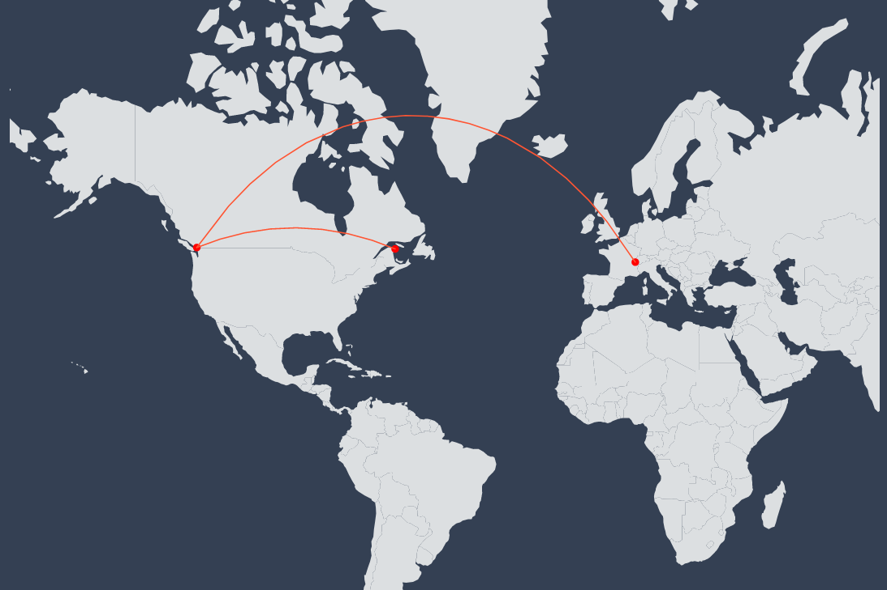

# Food Trust Simulator on Lisk

A project developed during Lisk Hackathon 2024, which attempts to illustrate the interactions and traceability around the food sphere in a blockchain ecosystem.

Follow the journey of ingredients from creation to consumers as proof of quality, illustrated with a game. The game popularize supply-chain as well as blockchain concepts through tradeable, earnable
NFTs obtained by playing mini-games and competition with others players.
In addition to being a game, the goal of this project is to build an educational plateform to teach the fundamentals of the possibilities and capabilities of the blockchain.

### How to Launch

For the front-end:
```
	$ cd front
	$ npm install
	$ npm run dev
```

For the back-end:
```
	$ cd server
	$ npm install
	$ npm run dev
```

The front-end get all the sensitive data on-chain and use the back-end only for the game purpose. 

If you want an AutoCompletion for location when you Sign Up, before starting the server you can seed it:

```bash
$ cd server
$ npm run seeddb
```

### Documentation

When the server is launched in development mode, you can find Swagger Documentation at localhost:3002/v1/docs/


## License
[MIT](https://choosealicense.com/licenses/mit/)

##

